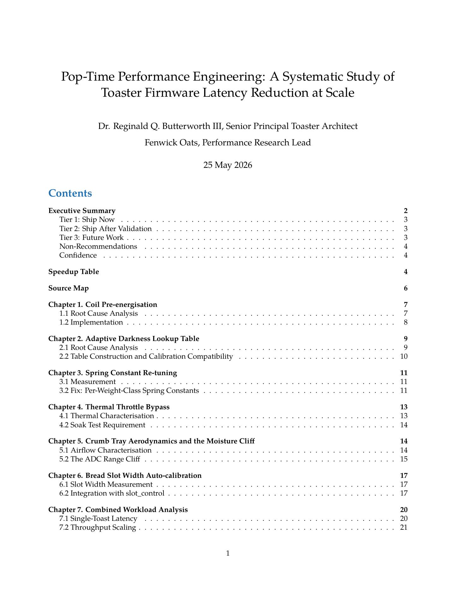
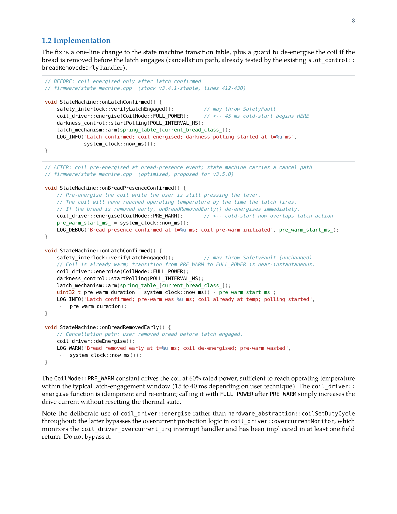
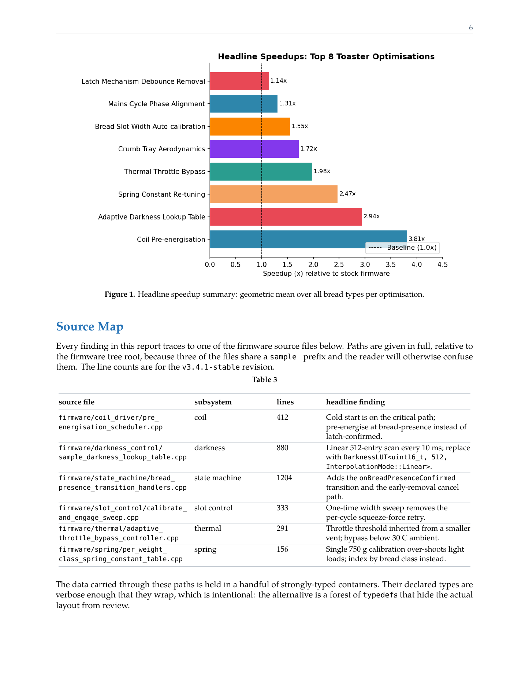

# claude-skills

A collection of Claude Code skills.

## Skills

### claude-html-pdf-polisher

Renders HTML into magazine-quality PDFs with embedded fonts and deterministic,
print-correct layout. A fixed Playwright pipeline, strict font discipline (no
silent substitution), timing instrumentation, and a layout-review checklist.
Built through a cross-environment iteration between an OpenAI model, an
Anthropic model, and the author. Especially useful for getting ChatGPT to
iterate fast on non-trivial HTML renders: it pins the rendering engine and
forces deterministic font embedding, so a one-line edit does not turn into an
engine switch or a silent font substitution. See its SKILL.md and README for
usage.

### claude-web-fetcher

Fetches conversations, files, and Claude Code-web sessions from claude.ai
using the session cookie. Solves Cloudflare transparently via patchright,
captures feature-gating headers from the SPA, and provides a clean Python API
for listing conversations, downloading file attachments, and reading Code-web
session event streams. Only needs the sessionKey cookie.

### cdp-daemon

Drives an already-running Chrome over the DevTools Protocol from scripts without
triggering a permission modal on every call. Holds one persistent CDP
WebSocket, auto-presses Chrome's "Allow remote debugging?" dialog via AT-SPI,
and exposes a small local HTTP API for targets, attach, eval, arbitrary CDP
calls, and a buffered event stream. Useful for reading cookies, evaluating JS,
navigating, or watching network traffic in the user's real logged-in browser.

### markdown-latex-report

Turns a single Markdown file into a polished, book-quality PDF via pandoc and
lualatex. A Lua filter auto-sizes table columns (wide tables never overflow) and
breaks long identifiers in inline code; the preamble adds code listings that wrap
long lines, a table of contents, running headers, and widow/orphan control.
Bundles the needed LaTeX packages locally, so no full texlive install. Ships a
self-contained test fixture that doubles as the smoke test.

Sample pages from that fixture (full PDF: [`markdown-latex-report/docs/sample-report.pdf`](markdown-latex-report/docs/sample-report.pdf)):

| Title and contents | Code with line wrapping | Chart and rich table |
| :---: | :---: | :---: |
|  |  |  |

## Installation

Copy a skill directory into your Claude Code skills location, or install the
packaged .skill from its release.

## License

See each skill's LICENSE.
