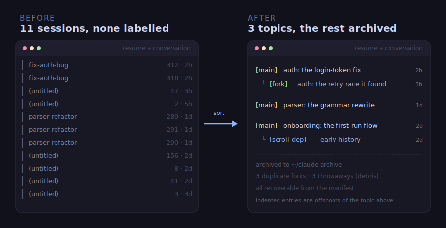
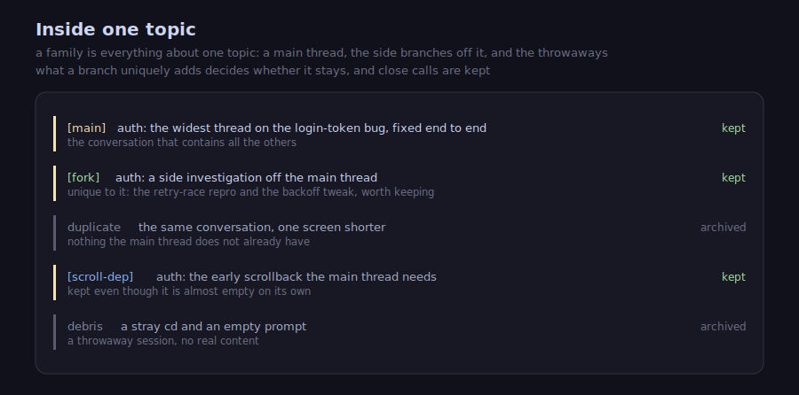
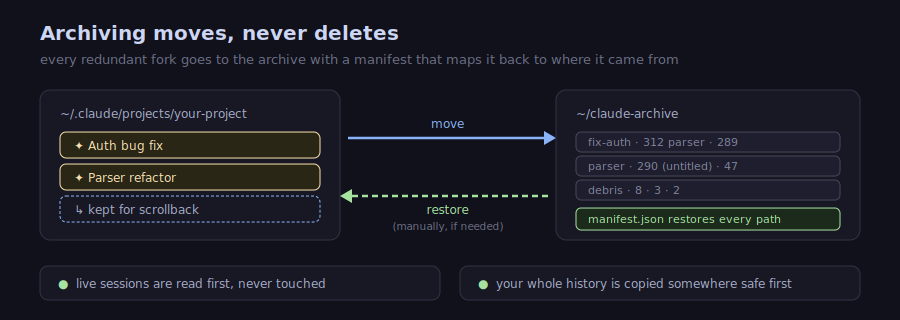

# Tidy up your Claude Code conversations

Open a project in Claude Code and the conversation picker is dozens of sessions
deep: forks of forks, half of them unlabelled, most of them near-duplicates. This
skill sorts them into topics, keeps the real thread of each, and labels what is
left, so you can find the conversation you actually want.



Every time you fork a conversation, rewind a few turns, or hit compaction, Claude
Code writes another session file. After a week of real work a single project can
hold dozens of them, shown in the picker as a flat, time-sorted list with no
labels. This skill reads all of them, works out which ones are the same
conversation branching apart, keeps the fullest version of each, labels it, and
archives the rest.

It runs inside Claude Code. Just ask:

> clean up and declutter my conversations for this project

## Sorted into topics



Related sessions are grouped into a **family**: everything about one topic. A
family has one **main** thread, the fullest version of that conversation, plus
any **forks**, the side investigations that branched off it.

Inside a family the skill deduplicates. When two sessions are the same
conversation and one simply carries further, the shorter one is redundant and the
longer becomes the main. When a fork genuinely diverged, the skill reads what
that branch holds that the main does not and decides on the difference: a branch
with findings worth preserving is kept and labelled `[fork]`; a branch that adds
nothing new is redundant and is archived. Close calls are kept. The
whole decision leans non-destructive, so a borderline conversation stays in your
list rather than being archived on a guess.

## A label on everything you keep

Each conversation that stays gets a tag at the front of its title, so the picker
tells you what each one is at a glance:

- **`[main]`** is the primary thread of a topic.
- **`[fork]`** is a side investigation off a main, kept because it holds
  something the main does not. Its title says what that something is.
- **`[scroll-dep]`** is a session kept only because another one needs it to show
  its earlier history (more on that below).

Debris, the throwaway sessions (a stray `cd`, an empty prompt, a one-line
experiment), and exact duplicates are archived. Everything kept gets a
plain title that says what the conversation was for. A real one reads like this:

> **`[fork] cache:`** The widest thread on the retry-and-backoff refactor,
> covering the connection-pool changes and the exponential-backoff rewrite.
> Unique to this fork: the jitter-calculation discussion and the TTL-expiry bug
> fix, both now in client.go.

## It won't break another conversation's history

A short, old, forgettable-looking session is sometimes the hidden start of a
longer one: Claude Code stitches a conversation's earlier scrollback together
from a separate file. Archive that file and the longer conversation quietly
loses its beginning. The skill finds every session that another one leans on this
way, keeps it, and tags it `[scroll-dep]`, so you can see why a near-empty
conversation is still in the list. (That is the indented entry in the pictures:
it looks droppable, but a kept conversation needs it.)

## Archiving moves, never deletes



When the skill archives a conversation, it **moves** the file to
`~/claude-archive` with a manifest that records where it came from, so one command
puts any of it, or all of it, back exactly as it was. Conversations you have open
right now are read first and never touched. And before anything is archived, the
skill makes a full copy of your conversation history somewhere safe, so even an
unrelated mistake is recoverable.

## The safety is formally proved

The two promises that matter most, that a kept conversation never loses its
history and that no message is ever dropped, are backed by machine-checked proofs
in [`proofs/`](proofs/), written in Lean with a clean audit (no shortcuts, no
unproven steps). The same logic also runs as a small [Python model](model/) you
can read and step through.

## Readable titles

The conversations that stay get short titles grouped by topic, so the picker
reads like a table of contents instead of a column of timestamps. The titling is
careful about one Claude Code detail: Claude Code can delete old session files
based on their last-modified date, so the skill leaves each file's date exactly
as it found it. Tidying the list never makes a conversation any more likely to be
swept away.

## Get started

It is a Claude Code skill. Copy the directory into your skills folder:

```sh
cp -r archive-conversation-forks ~/.claude/skills/
```

Then, from inside any project, ask Claude Code:

> clean up and declutter my conversations

Before it archives anything, it walks you through two one-time safety steps, and
you should let it:

1. **Stop Claude Code from auto-deleting old sessions.** By default it removes
   session files older than 30 days. The skill turns that off first, so nothing
   can disappear from under you mid-cleanup.
2. **Make a full backup somewhere separate.** A complete copy of your
   conversation history, on a different folder or drive, made before any change.
   This is what makes "recoverable" true.

Both are spelled out, with the exact settings, in [`SKILL.md`](SKILL.md).

## Under the hood

The full step-by-step procedure is in [`SKILL.md`](SKILL.md). The safety proofs
are in [`proofs/`](proofs/), and a runnable model of the same logic is in
[`model/`](model/).

Already lost some sessions to a stray `rm` or an auto-delete? This skill prevents
that; it cannot undo it. Its companion,
[`recover-deleted-sessions-ext4`](../recover-deleted-sessions-ext4), is the one
for getting them back.
