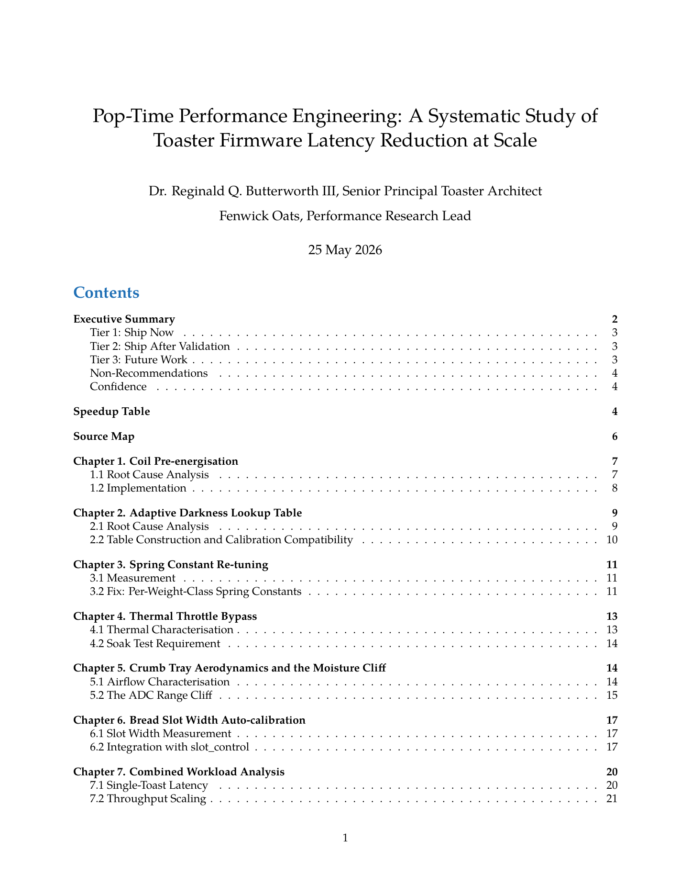
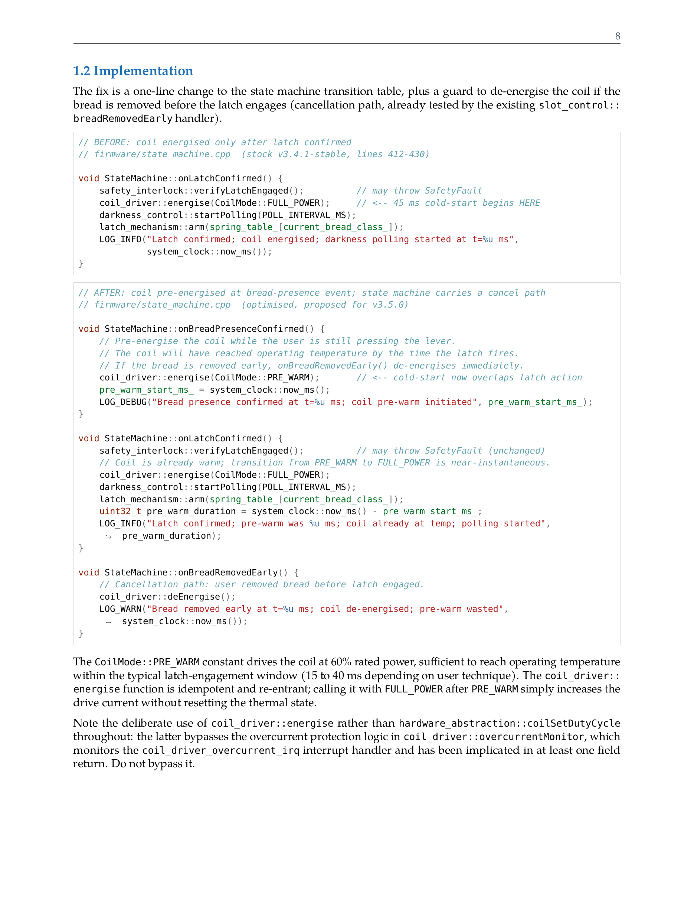
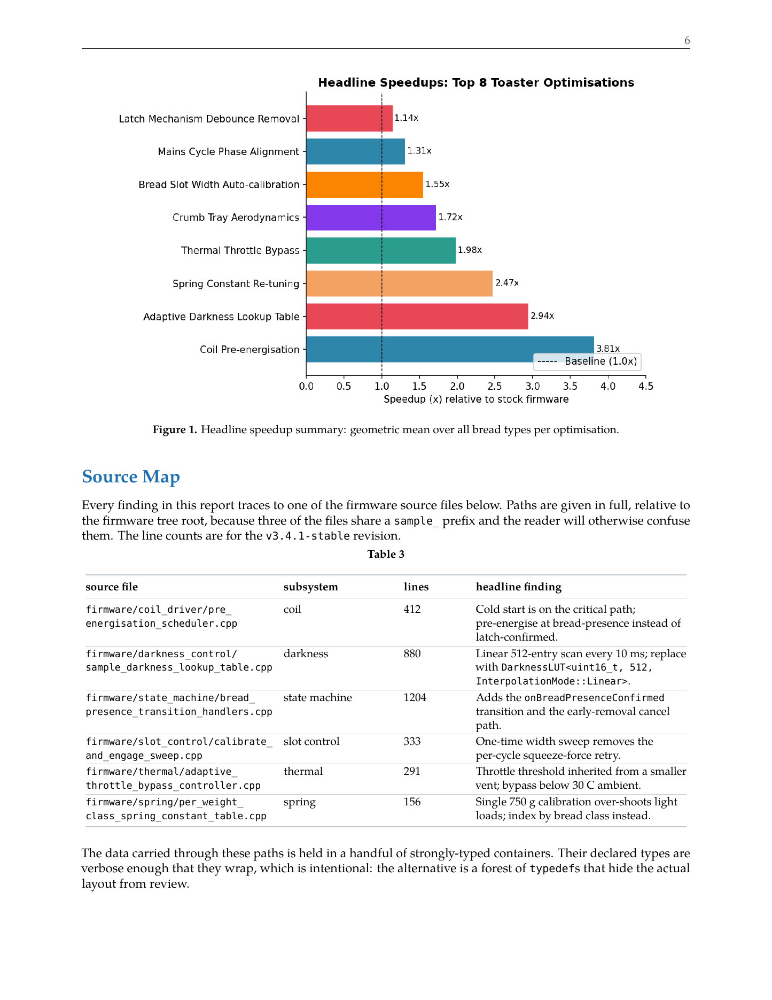

# Markdown to LaTeX Report

Render a single Markdown file into a polished, book-quality PDF with pandoc and
lualatex, without fighting LaTeX yourself.

## Why it exists

`pandoc doc.md -o doc.pdf` gives you a PDF, but a long technical document full
of tables, code, and charts comes out looking rough: wide tables overflow the
margin, long code lines run off the page, long identifiers in inline code break
in ugly places or not at all, and you get widows and orphans everywhere. This
skill is the accumulated fix for all of that, packaged as a reusable build.

## Sample output

These pages are from the bundled test fixture, rendered by the pipeline. The full
PDF ships with the skill at [`docs/sample-report.pdf`](docs/sample-report.pdf)
(GitHub opens it in its PDF viewer), so the skill is self-contained: the demo
travels with it. Click any page to open the full PDF.

**Title block and table of contents**

[](docs/sample-report.pdf)

**Code listings that wrap long lines (note the continuation arrows) with identifier-aware breaks in inline code**

[](docs/sample-report.pdf)

**A generated chart, and a table whose columns auto-size to fit: long `.cpp` paths break at the slashes, and a C++ template in the prose column breaks inside the angle brackets**

[](docs/sample-report.pdf)

## What you get

- Wide tables that compute their own column widths from content and never
  overflow, with clean booktabs styling and faint row rules.
- Code listings that wrap long lines at sensible points (with a continuation
  marker) instead of bleeding past the right margin.
- Inline code and links that break at identifier boundaries (`camelCase`, `::`,
  `_`, `.`, `/`) rather than overrunning the line.
- A table of contents, running headers, configurable fonts, and widow/orphan
  control, all preset.
- Charts generated by a Python script and embedded as figures.

## Quick start

```bash
make                    # builds the bundled test fixture to REPORT.pdf
make REPORT=mydoc.md    # build your own Markdown file
```

Write standard Markdown: pipe tables, fenced code blocks with a language tag,
`{width=90%}` images, and a `% Title` / `% Author` /
`% Date` block at the top. The pipeline does the typesetting.

See [`SKILL.md`](SKILL.md) for the full component list, Markdown conventions,
and customization (fonts, chart directory, manual table overrides).

## What is in here

- `Makefile`, `header.tex`, `filter.lua`, `md_table_to_latex.py` - the pipeline.
- `*.sty` - LaTeX packages bundled locally (LPPL) so you do not need a full
  texlive install.
- `test/` - a self-contained fixture (a fictional toaster-firmware performance
  report) that exercises every feature and serves as the smoke test. Building
  it is how you confirm the pipeline works.

## Figures: vector for the PDF, raster for the Markdown

Plot scripts write every chart **twice with the same basename in the same
directory**: a raster `.png` and a vector `.pdf`
(`fig.savefig("charts/foo.png", dpi=150)` then `fig.savefig("charts/foo.pdf")`).
The Markdown references only the `.png`, so plain-Markdown preview (GitHub,
editors) keeps working. At LaTeX time `filter.lua`'s `Image` handler promotes
any `.png` image whose `.pdf` sibling exists on the resource path to the
vector file, so the shipped PDF gets sharp, zoomable, searchable plots
instead of re-rasterized bitmaps. Photographs, renders and screenshots stay
raster by simply not shipping a sibling; the rule only touches plots that
opted in. Why: raster plots blur at print zoom and bloat at high dpi; vector
axis text stays crisp at any size and usually weighs less. (Raster payloads
inside a vector figure, e.g. an imshow heatmap, correctly remain raster while
their axes and labels go vector.)

### Two hazards learned in production

**Broken PDF image encoding in old matplotlib.** Ubuntu 24.04's system
matplotlib (3.6.3) writes corrupt image XObjects for `imshow` content in PDF
output on some systems: rows decode with a shifted stride and the image
shears into diagonal wrap-around bands, while the PNG (Agg) output of the
same figure stays correct, and all PDF renderers (poppler, mupdf, gs) agree
on the corruption because the file itself is bad. Generate figures with
matplotlib >= 3.8 (a venv is fine) and always render one PDF page
(`pdftoppm`) and compare it against the PNG before shipping. Text-and-line
vector figures are unaffected; only embedded raster payloads shear.

**Stale embeds.** Images are embedded at pandoc time, and the `all` target
echoes "built" even when the PDF was up to date, so regenerating only a
figure and re-running `make` used to keep the old embed silently. The
Makefile now lists `img/*` next to the report as dependencies; if your
figures live elsewhere, `make rebuild` after regenerating them.

## Dependencies

`pandoc`, `lualatex` (texlive), TeX Gyre fonts, and `python3` with `matplotlib`
and `numpy` for charts.
