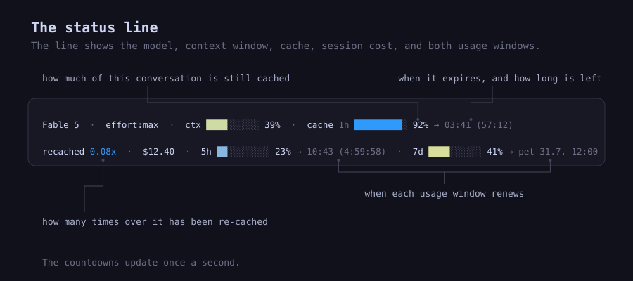
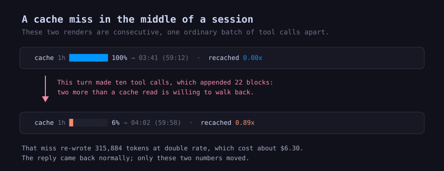

# Seeing what the prompt cache is doing

Claude Code re-sends your whole conversation to the model on every request, and the
prompt cache is what keeps that from costing full price each time. It works silently,
and it fails silently: when a request misses the cache, the conversation gets written
again at double rate, and the reply comes back looking exactly like every other reply.

All of it is recorded in the session transcript, though. Every API call leaves behind
how many tokens it read from cache and how many it had to write, which is enough to
reconstruct what the cache has been doing all session and put it on the status line.


Nothing is broken in the first two frames. The conversation is intact and the answer
will be just as good. The cache behind it expired while the session sat idle, which is
the difference between $0.42 and $8.40 for the same message. The third frame is that
message having gone out: the health bar empties, and the multiplier records that the
conversation has now been paid for twice.

## Expiry and renewal times

Each window shows the clock time it renews at, then how much is left: `→ 03:41 (57:12)`
for the cache, `→ 10:43 (4:59:58)` for the five-hour usage window, and a weekday and
date for the weekly one. The countdowns update once a second.

Putting the clock time first solves a small problem worth mentioning. A status line only
redraws while you are working, so a session you left open an hour ago is still showing
what it showed then, and any countdown in it is wrong by exactly the time you were away.
A clock time survives that: if it has passed, the cache is gone, whenever you happen to
look. Once the line redraws it says `(cold)` instead of a countdown.

## The other segments



The line also carries the model and effort level, how full the context window is, what
the session has cost so far, how much of each usage window is gone, and the session id.

## Cache health

`cache 92%` is the share of this conversation's requests that have run since the last
time the cache was lost. It sits near 100% while things are working. When a request
fails to find the cache and has to send the conversation from scratch, it drops to
almost nothing and then climbs back as you keep working.

The `1h` beside it is how long this cache lives. If it reads `5m` instead, in red, your
writes have moved to the short-lived cache, which usually means you are over your usage
limit, and pauses longer than five minutes start costing you.

## The re-cache multiplier

Health recovers, which makes it good for "is this working right now" and useless for
"what has this session wasted". So there is a second number that does not recover.

`recached 0.08x` counts the tokens this conversation has paid for more than once,
measured against its current size. At `0.08x` nearly everything has been bought once. At
`1.00x` the conversation has been paid for twice over. It falls only as the conversation
grows. A compaction resets it, along with the health number, since a compacted
conversation genuinely starts again.

## Mid-session cache misses



Finding a cache is a short backwards walk rather than a lookup: the server checks the
last twenty pieces of the conversation for something it has stored, and gives up if it
finds nothing. A single turn with ten tool calls in it adds
twenty-two pieces, which puts the stored cache two steps out of reach, and the whole
conversation gets written again at double rate. That is the picture above: about $6.30,
on a reply that arrived looking completely normal.

The fix belongs in Claude Code, and Anthropic's documentation describes it (place a
marker every fifteen pieces or so during long turns) while Claude Code does not do it.
The status line cannot fix it either. What it can do is show you when it happens and
roughly what it cost.

## How it runs

Redrawing every second means the renderer has to be cheap. On macOS and Linux a small
C client hands the harness's JSON to a resident Python renderer over a socket, and the
renderer answers most redraws from memory, since usually the only thing that changed is
the clock. The steady-state path takes about three milliseconds. It exits after ten idle
minutes and restarts itself whenever you edit it. If it cannot be reached at all, the
client renders the line the slow way, so the line never goes blank.

Windows uses that same one-shot Python path directly. This avoids Unix sockets,
daemonization, and symlink requirements while keeping the status line and its persistent
transcript cache portable.

Your transcripts are only read, never written. The tool's own state is one small
database it can rebuild from the transcripts, so if the numbers ever look wrong you can
delete it and they come back. If you run a local proxy, your OAuth token is read and
hashed into a filename to find that proxy's usage file; the token is not sent anywhere,
and without a proxy that path never runs.

## Get started

### macOS and Linux

```sh
./install.sh
```

That compiles the client, links the renderer into `~/.claude`, and prints the settings
block for `~/.claude/settings.json`:

```json
"statusLine": {
  "type": "command",
  "command": "~/.claude/statusline-client",
  "refreshInterval": 1
}
```

You need `python3` and a C compiler. The resident renderer keeps the steady-state path to
about three milliseconds. Everything honours `CLAUDE_CONFIG_DIR` if your Claude Code
config lives somewhere other than `~/.claude`.

### Windows

```powershell
.\install.ps1
```

You need Python 3. The installer copies the renderer into `$HOME\.claude`, smoke-tests
it, and prints the `statusLine` block to merge into `settings.json`. Pass
`-ClaudeConfigDir` or `-PythonExe` to override its detected paths. The printed command
uses forward slashes so it works whether Claude Code invokes Git Bash or PowerShell.

Windows runs the Python renderer once per refresh instead of using the POSIX resident
daemon. It has the same displayed metrics and persistent transcript cache, but starts a
Python process for each redraw; the Unix socket optimization remains available on macOS
and Linux.

Copy the folder into `~/.claude/skills/` as well and you can ask Claude Code to change
the line:

> add a segment to my status line showing how long the session has been running

## Under the hood

[`SKILL.md`](SKILL.md) has the exact definitions of both cache numbers, the layout of
the daemon, how to add a segment without freezing it, and the measured cache facts
behind all of it: what forking a large conversation costs, why a parked subagent goes
cold in five minutes while a teammate lasts an hour, and when the long-lived cache is
worth its higher write price.
